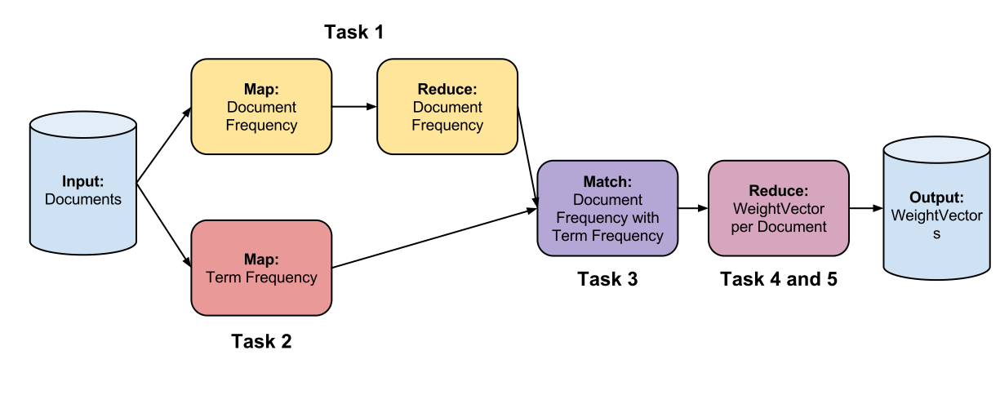
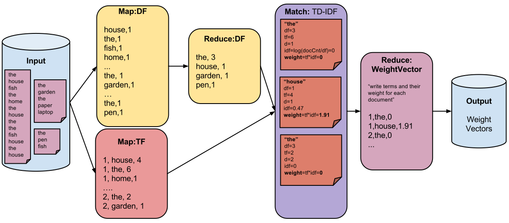

--- 
layout: default_exercise
title:  "Exercise 1: Tf-Idf"
tasks: 
  -       { anchor: overview, title: "Overview"}
  -       { anchor: task1, title: "1: Document Frequency" }
  -       { anchor: task2", title: "2: Term Frequency" }
  -       { anchor: task3, title: "3: Join" }
  -       { anchor: task4, title: "4: WeightVector" }
  -       { anchor: task5, title: "5: WeightVector per Document" }
---

<section id="overview">
## Overview

In this programming assignment, you are going to compute [tf-idf](http://en.wikipedia.org/wiki/Tf%E2%80%93idf) weights for a small dataset in Stratosphere. You will be introduced to the main concepts in the respective subtasks.

The following figure gives an overview of what we are going to do in each task:




<button class="btn btn-primary" id="show-plan-example">Show more detailed example</button>



</section>

<section id="task1">
## Task 1: Document Frequency
<div class="progress">
  <div class="progress-bar" role="progressbar" aria-valuenow="60" aria-valuemin="0" aria-valuemax="100" style="width: 1%;">
    <span class="sr-only">1% Complete</span>
  </div>
</div>

You are first going to calculate the document frequency. That is, in how many documents each distinct word occurs.
So if a document contains a word three times, it is counted only once for this document. But if another document contains the word as well, the overall frequency is two.

Besides this, you need to do some data cleansing on the input data. That is, accept only terms (words) that are alphanumerical. There is also a list of stopwords (provided by us) which should be rejected.

To achieve this, you need to implement a Mapper and a Reducer. The input file is a regular text file that contains a line for each document.
The schema of the input file looks like this:
```
docid, document contents
```
The Mapper is called with the documents. So each call of the `map()` function gets one line (e.g. a document).

You need to do the following in the Mapper: First, split the input line so that only alphanumerical words are accepted. Remember to remove the document id. 

Then, check if the individual terms are in the HashSet (`Util.STOP_WORDS`) of stopwords. You do not need to do additional extra checks because we already checked the input.

You should also use a [HashSet](http://docs.oracle.com/javase/7/docs/api/java/util/HashSet.html) to check if the word already occured for the given document. Remember, count each word only once here.

The last step is to emit all words with a frequency count of 1. Use a `PactRecord` with two fields. Set the word as the first field and the count (always 1) as the second field.
You have to use the build-in datatypes for `String` and `int` (`PactString` and `PactInteger`).
Use the output collector (second argument of `map()`) to emit the `PactRecord`


Use the provided `main()` method to test your code.

Task #1 is quite similar to the classical WordCount example, which is something like the "Hello World" of Big Data.
</section>

<a name="task2"></a>
<h2 class="page-header">Task 2: Term Frequency</h2>
<div class="progress">
  <div class="progress-bar" role="progressbar" aria-valuenow="60" aria-valuemin="0" aria-valuemax="100" style="width: 20%;">
    <span class="sr-only">20% Complete</span>
  </div>
</div>

Implement a second Mapper that also reads in the documents from the same file. 
This time, the output tuples shall look like this `(docid, word, frequency)`.

You should use the same splitter for the input line as in Task #1. But this time, use the `docid`. 
Use a HashMap to identify the frequency of each word in the document.

<section id="task3">
## Task 3: Join

<div class="progress">
  <div class="progress-bar" role="progressbar" aria-valuenow="60" aria-valuemin="0" aria-valuemax="100" style="width: 40%;">
    <span class="sr-only">40% Complete</span>
  </div>
</div>

This task uses a new Contract: Match. It has two inputs, namely the outputs from the previous tasks.

In the `MatchStub`, the `match()` method has two parameters, a `PactRecord` from each input that matched on the term.

The following pseudo code describes what the join does.

```javascript
match( (word, df), (docid, word, tf)) {
	tf_idf(word) = tf * log [Util.NUM_DOCUMENTS/df]
	return (docid, word, tf_idf(word))
}
```
</section>

<section id="task4">
<h2 class="page-header">Task 4: Custom Type</h2>

<div class="progress">
  <div class="progress-bar" role="progressbar" aria-valuenow="60" aria-valuemin="0" aria-valuemax="100" style="width: 60%;">
    <span class="sr-only">60% Complete</span>
  </div>
</div>

Stratosphere comes with a bunch of build-in datatypes. For this assignment, you are going to implement your own. This task is a preparation for the last one. We want to store a `WeightVector`.
The datatype has a `add(String, double)` method to store the weight of each word.

The main task here is implementing the data de/serialization methods which are used before transferring the data through the network or to disk.

We recommend to store each `(String, double)` pair in two lists.
</section>

<section id="task5">
<h2 class="page-header">Task 5: Custom Type</h2>

<div class="progress">
  <div class="progress-bar" role="progressbar" aria-valuenow="60" aria-valuemin="0" aria-valuemax="100" style="width: 80%;">
    <span class="sr-only">80% Complete</span>
  </div>
</div>

This reduce task takes the output of the join and groups it by the document ids (`docid`).
Write the document id and the terms including their weight into the `WeightVector` you have created in the previous task.
</section>

## Congratulations!

<div class="progress">
  <div class="progress-bar progress-bar-success" role="progressbar" aria-valuenow="60" aria-valuemin="0" aria-valuemax="100" style="width: 100%;">
    <span class="sr-only">100% Complete</span>
  </div>
</div>